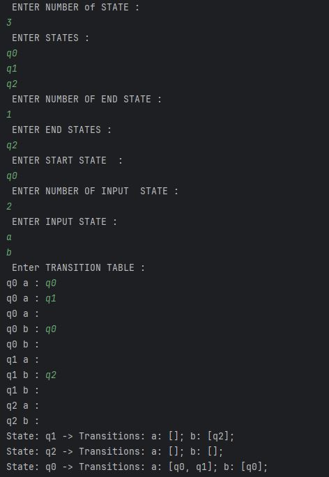
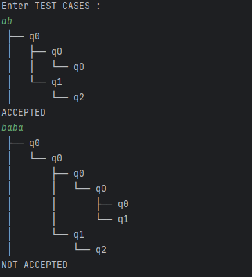

# 🤖 NFA Simulator
This is a simple Non-deterministic Finite Automaton (NFA) simulator that helps you define an NFA, set transitions (including multiple or ε-transitions), and test input strings to see if they are accepted by any valid path through the machine.

---

## 📌 Preview Sections

### 🧠 1. Question / Problem
This is the task or theoretical question that the NFA simulator addresses.

📷 **Preview**:

---

### 🧾 2. Input Setup

📷 **Preview**:

---

### 📤 3. Output Execution
Run test cases to verify if they are accepted or rejected based on your DFA.

📷 **Preview**:

---

